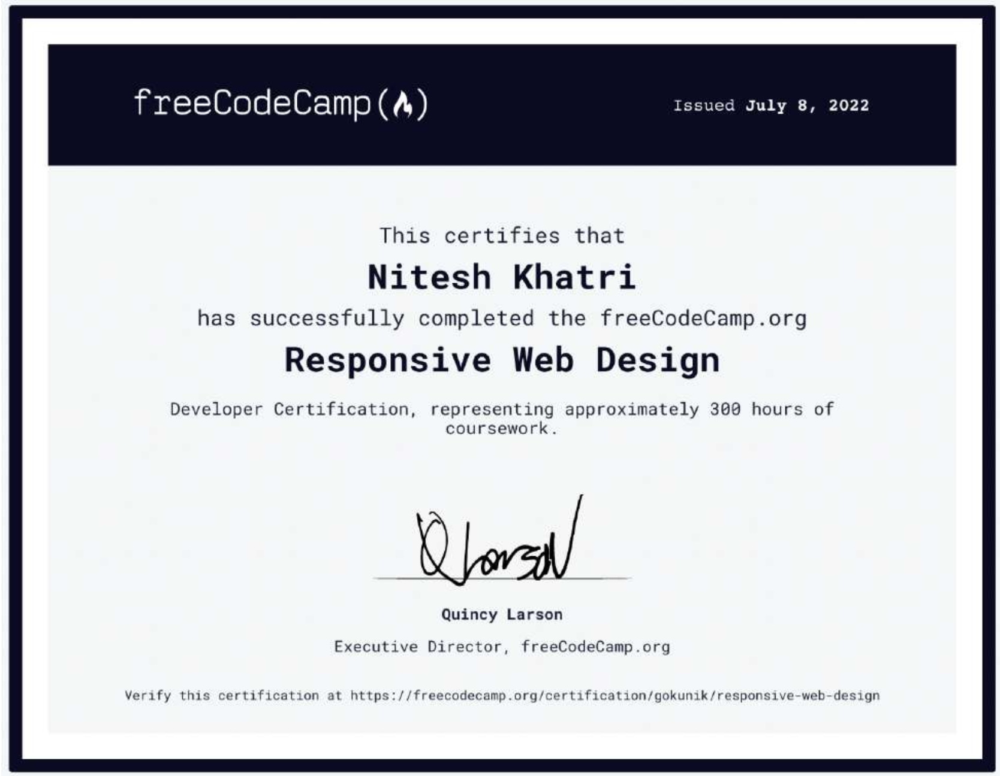

# FreeCodeCamp Certification projects

 &nbsp;
 &nbsp;
 &nbsp; 
 &nbsp;

This repo contains my submition for the certification of freeCodeCamp Projects. It contain a total of 5 Projects.

Link to projects [codepen](https://codepen.io/gokunik)

#### Certificate
